# 🧩 Compose Multiplatform Clean Architecture App

This project is built using **JetBrains Compose Multiplatform** and follows a **Clean Architecture** pattern. It supports both **Android** and **iOS** platforms and is structured for scalability, modularity, and testability.

---

## 🏗️ Tech Stack

| Layer         | Library                                           |
|---------------|---------------------------------------------------|
| UI            | [JetBrains Compose Multiplatform](https://github.com/JetBrains/compose-multiplatform) |
| Dependency Injection | [Koin](https://insert-koin.io/)                    |
| Networking    | [Ktor Client](https://ktor.io/)                   |
| Local Database| [SQLDelight](https://cashapp.github.io/sqldelight/) |
| Architecture  | Clean Architecture (Presentation → Domain → Data) |

---

## 📦 Features

- ✨ Kotlin Multiplatform (Android + iOS)
- ✅ MVVM with Clean Architecture
- 📦 Dependency injection via Koin
- 🌐 Networking using Ktor
- 💾 Local persistence using SQLDelight
- 💡 Modular and maintainable codebase
- 🧪 Ready for testing and scaling

---

## 🖼️ Android Screenshots


<p align="center">
  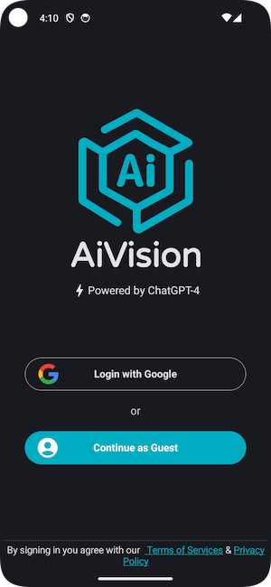
  
</p>
<p align="center">
  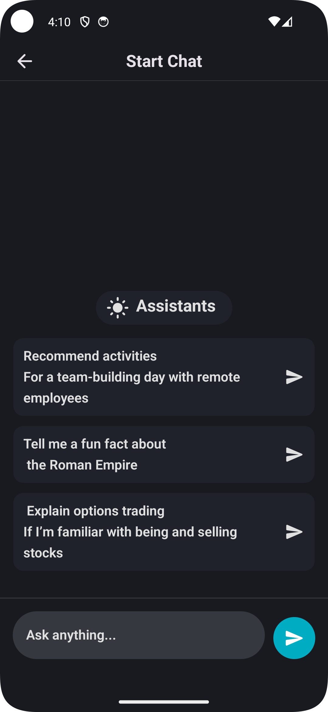
  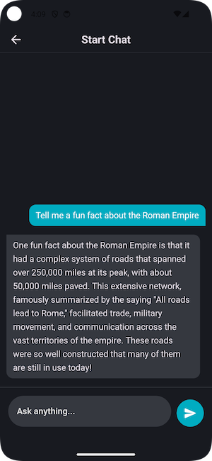
</p>

<p align="center">
  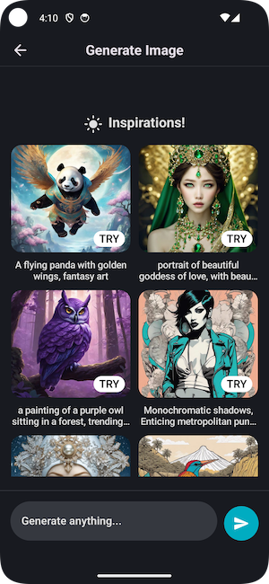
  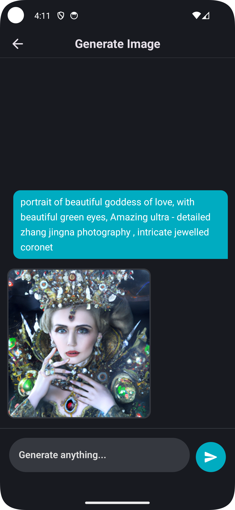
</p>

<p align="center">
  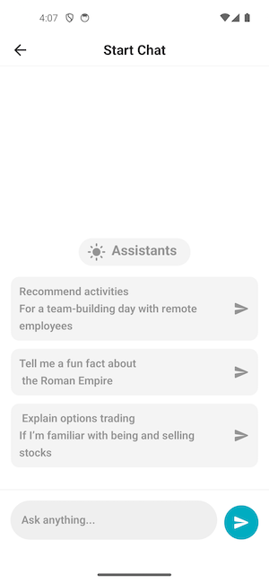
  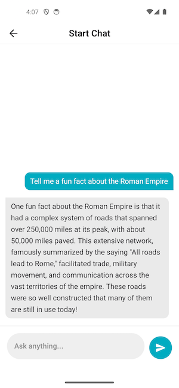
</p>

<p align="center">
  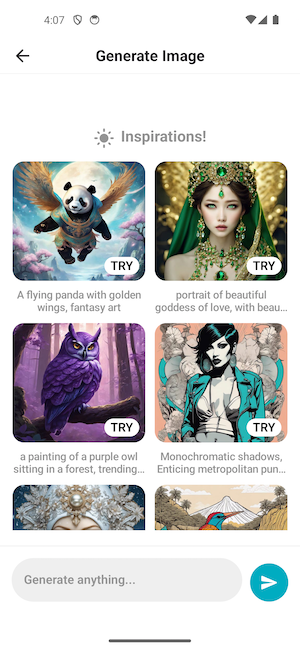
  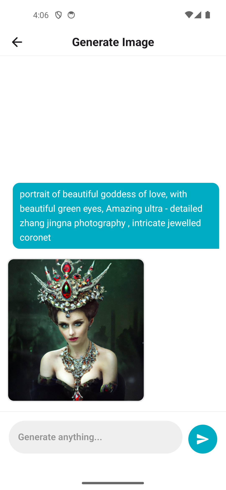
</p>


## 📱 iOS Screenshots

<p align="center">
  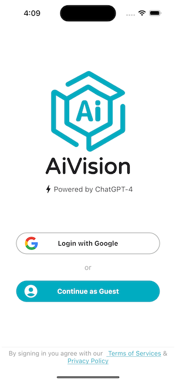
  
</p>

<p align="center">
  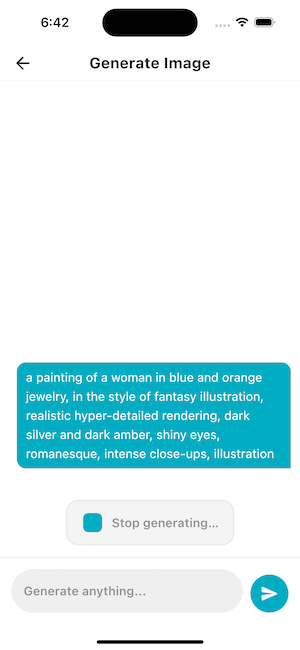
  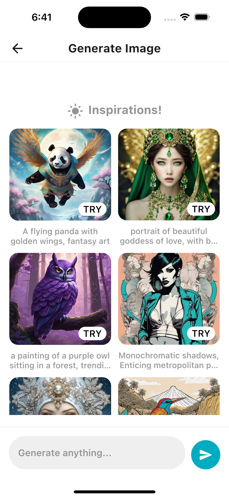
</p>
)

## 🚀 Getting Started

### 🔧 Prerequisites

- JDK 17 or later
- Android Studio Giraffe or later
- Kotlin Multiplatform plugin
- Xcode (for iOS builds)
- Replace gpt_key with your own key

### ▶️ Run Android App

```bash
./gradlew :androidApp:installDebug
Or run directly from Android Studio.

🍏 Run iOS App
1.Open iosApp/iosApp.xcworkspace in Xcode
2. Select your target device or simulator
3. Build and Run